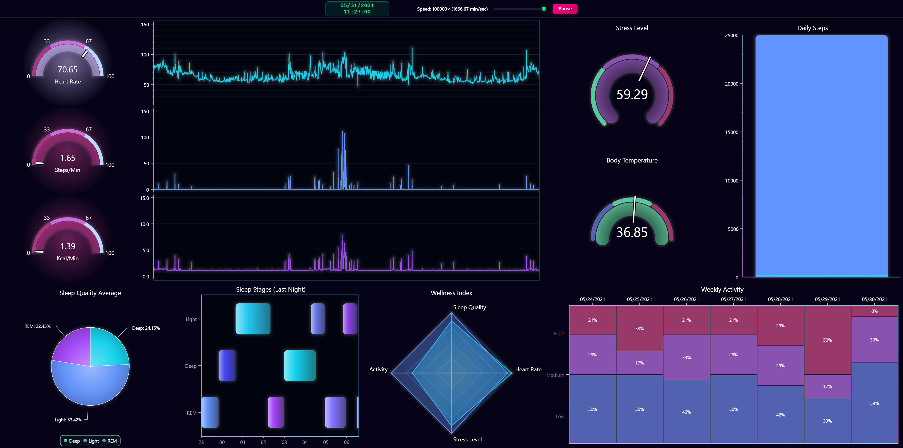

# JavaScript Wellness Dashboard

This project is an application demonstrating LightningChart JS, a high-performance data visualization library for JavaScript. The dashboard simulates wellness and health monitoring data playback, showcasing various chart types and interactive visualizations with time-based data simulation.

LightningChart JS is entirely GPU accelerated and performance optimized charting library for presenting massive amounts of data. It offers an easy way of creating sophisticated and interactive charts and adding them to your website or web application.


## Description

The Wellness Dashboard is a comprehensive health monitoring application that displays fitness and wellness data through interactive data playback simulation. It features multiple chart types to visualize different aspects of health data with controllable time progression.

### Screenshot

*LightningChart JS Wellness Dashboard showing real-time health data visualization with multiple chart types*

### Key Features
- **Time-based simulation**: Data playback simulating minute-by-minute health tracking with adjustable speed control (from 1 min/sec up to ultra-fast simulation) and play/pause functionality.
- **Time-based events**: Data updates every minute, with special updates at midnight (Activity Summary) and 8 AM (Sleep Analysis, Wellness Index).
- **Comprehensive health metrics**: Heart rate, activity (steps/min, kcal/min), stress level, body temperature, daily steps count, sleep quality averages, previous night’s sleep stages, 7 day’s activity levels, wellness index (shows how the user’s points compare to the average person’s).
- **Responsive design**: Optimized layouts for desktop, tablet, and mobile devices with scrollable interface on smaller screens.

### Featured Chart Types
- **Multi-Chart**: Synchronized heart rate, calories, and steps visualization.
- **Gauge Charts**: Stress level and body temperature monitoring.
- **Bar Chart**: Daily steps progress tracking with target (25k) visualization.
- **Pie Chart**: Sleep quality averages over 7 days with stage breakdown.
- **Span Chart**: Sleep stages timeline (Light, Deep, REM sleep) with time-based visualization.
- **Spider Chart**: Wellness index radar showing multiple health metrics comparison.
- **Mosaic Chart**: 7-day activity levels.

### Data Source
The data is based on one person's health data, edited and adapted from this dataset: 

*Yfantidou, S., Karagianni, C., Efstathiou, S., Vakali, A., Palotti, J., Giakatos, D. P., Marchioro, T., Kazlouski, A., Ferrari, E., & Girdzijauskas, Š. (2022). LifeSnaps: a 4-month multi-modal dataset capturing unobtrusive snapshots of our lives in the wild (Version 4) [Data set]. Zenodo. https://doi.org/10.5281/zenodo.7229547.*


## How to Use

- Make sure that relevant version of [Node.js](https://nodejs.org/en/download/) is installed (Node 16+ recommended).

- Install http-server globally (required for the cyberSpace theme used in this project):
```bash
npm install --global http-server
```
*Note: This is only needed for certain LightningChart themes that use external assets. Built-in themes typically don't require this step.*

- Create an `.env` file in the `/frontend` folder and add your license key there. You can see the format in `/frontend/.env.example`:
```
REACT_APP_LCJS_LICENSE=your_license_key_here
```

- Install dependencies in terminal, in project root:
```bash
npm install
```

- Start the development servers (backend, frontend, and LightningChart resources):
```bash
npm start
```

- The application will be available at:
  - Frontend: http://localhost:3000
  - Backend API: http://localhost:5000
  - LightningChart Resources: http://localhost:8080

### Controls:
- **Speed Slider**: Adjust simulation speed from 1 min/sec to 1000+ min/sec
- **Play/Pause Button**: Start or stop the data simulation
- **Responsive Layout**: Automatically adapts to your screen size

### Project Structure
- `/backend` - Node.js server providing simulated health data APIs
- `/frontend` - React application with LightningChart JS visualizations
- `/frontend/src/components/charts/` - Individual chart controls
- `/frontend/src/utils/` - Data processing and calculation utilities
- `/frontend/src/styles/` - CSS styling for responsive design

### Dependencies
- **Core**: React 19.1.1, Node.js
- **Visualization**: @lightningchart/lcjs ^8.0.2
- **HTTP Client**: native fetch API
- **Theme Server**: http-server (globally installed, required for cyberSpace theme assets)
- **Development**: concurrently, react-scripts 5.0.1
- **Performance Monitoring**: web-vitals ^2.1.4


## Links
- [LightningChart JS Official Website](https://lightningchart.com/js-charts/)
- [LightningChart JS Documentation](https://lightningchart.com/js-charts/docs/)
- [LightningChart JS API Reference](https://lightningchart.com/js-charts/api-documentation/)
- [LightningChart JS Examples](https://lightningchart.com/js-charts/interactive-examples/)

## About the Creator
I'm an IT Engineering student passionate about software development, web technologies, and building practical projects.

This project is part of my internship at [LightningChart Ltd](https://lightningchart.com/), demonstrating how to build comprehensive data visualization dashboards with time-based data simulation, multiple chart types, and responsive design for various devices.

Feel free to connect or provide feedback!

*Created by Jenni Mikkonen*

